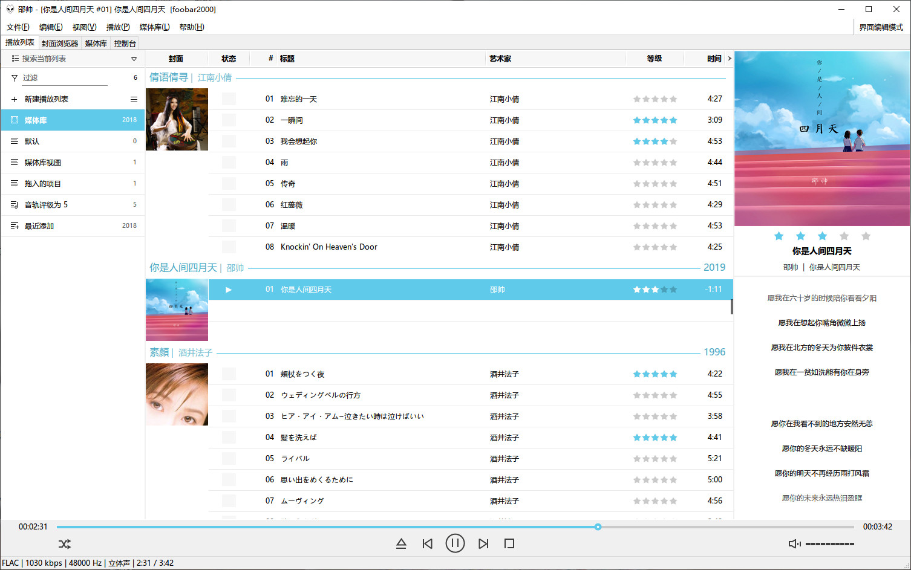

# foobox

foobox 是一个 foobar2000 界面配置，版本 7.0 由 CUI 转为原生的 DUI，foobox 简洁而美观实用，善于管理曲目数量大的媒体库 ，对音乐各种封面提供丰富的支持。
【安装】
你可以到 https://www.cnblogs.com/asionwu 下载，foobox 集成在 foobar2000 汉化版的plus版。
也可以下载 release 包直接复制到已有的 foobar2000 目录下。

